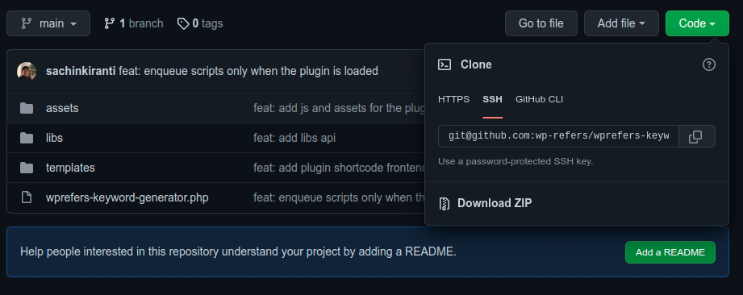

This plugin simply helps you discover keyword opportunities related to your query input.

## Installation

Download the zip file of the repository or clone the repository in your *wp-content/plugins*

1. Download the zip file

    As traditionally upload the plugin to your wordpress site and activate :smiley: .

    

2. Clone the repository
    
    ```git
    git clone git@github.com:wp-refers/wprefers-keyword-generator.git
    ```
   
    Activate it!

## Usage

Add the shortcode to wordpress POST/PAGE or anywhere you want to :

```
[wprefers-keyword-generator title="Keyword Generator" ]
```

The Output of the above shortcode :


## License
The Plugin is open-sourced software licensed under the [GNU license](LICENSE).

I would love if you could email me and tell me about your project and how this code was used :smiley: